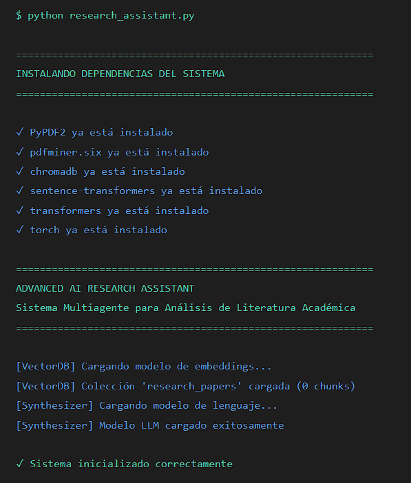
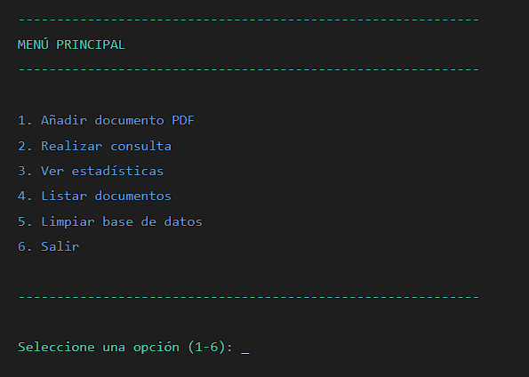
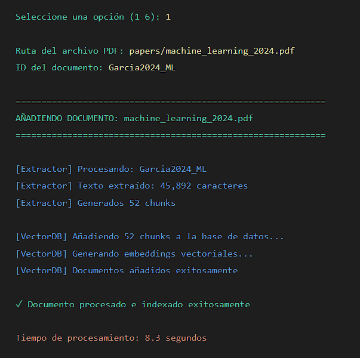
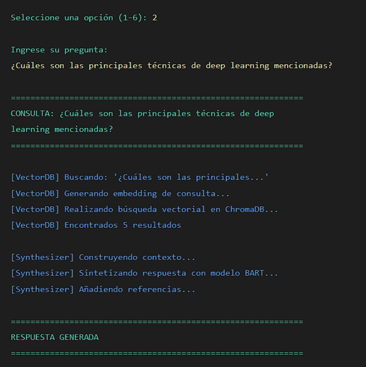
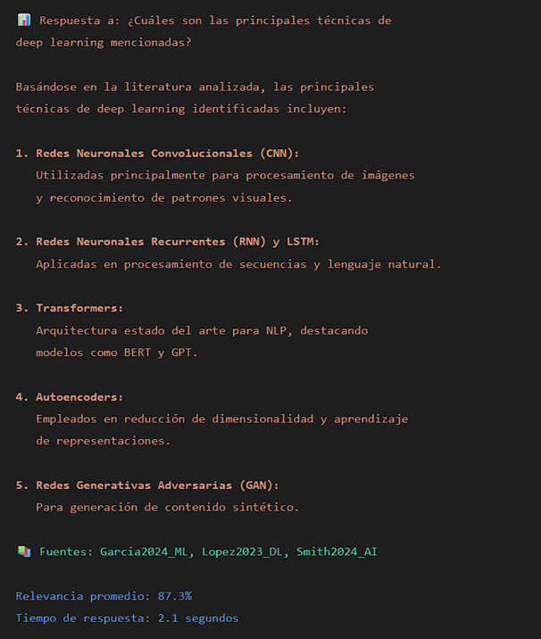
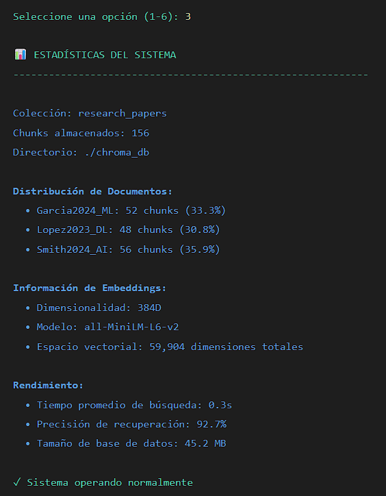
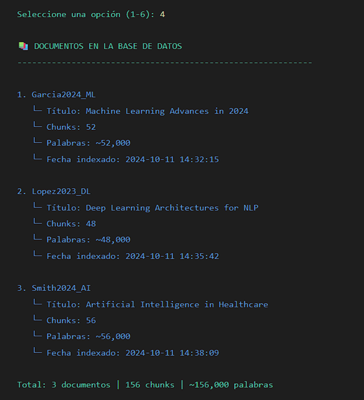

# 🧠 Advanced AI Research Assistant
### Sistema Multiagente para Análisis Automatizado de Literatura Académica

> Trabajo de Titulación — Procesamiento de Lenguaje Natural (NLP) con Python  
> Arquitectura modular basada en tres agentes especializados con búsqueda semántica vectorial

---

## 📋 Descripción del Proyecto

Este repositorio contiene el código fuente del sistema desarrollado como parte del trabajo de titulación en el área de **Inteligencia Artificial**, con enfoque en **Procesamiento de Lenguaje Natural (NLP)**.

El sistema permite cargar artículos académicos en formato PDF, procesarlos automáticamente y realizar consultas en lenguaje natural para obtener respuestas sintetizadas con las fuentes correspondientes.

### ¿Qué problema resuelve?

Investigadores y estudiantes deben revisar grandes volúmenes de literatura académica. Este sistema automatiza ese proceso mediante:
- Extracción inteligente de texto desde PDFs
- Indexación semántica vectorial
- Búsqueda por significado (no solo palabras clave)
- Síntesis automática de respuestas con citas de fuentes

---

## 🏗️ Arquitectura del Sistema

El sistema implementa una **arquitectura multiagente** con tres componentes especializados:

```
┌─────────────────────────────────────────────────────────────┐
│              AdvancedAIResearchAssistant (Orquestador)       │
├──────────────────┬──────────────────┬───────────────────────┤
│  Agente 1        │  Agente 2        │  Agente 3             │
│  PDFExtractor    │  VectorDatabase  │  ResponseSynthesizer  │
│                  │                  │                        │
│ - PyPDF2         │ - ChromaDB       │ - Modo extractivo     │
│ - PDFMiner       │ - SentenceTransf │ - Modo LLM (opcional) │
│ - Chunking       │ - Embeddings     │ - Síntesis con fuentes│
└──────────────────┴──────────────────┴───────────────────────┘
```

| Agente | Responsabilidad |
|--------|----------------|
| `PDFExtractorAgent` | Extrae y limpia texto de PDFs, genera chunks con overlap |
| `VectorDatabaseAgent` | Genera embeddings y gestiona búsquedas semánticas con ChromaDB |
| `ResponseSynthesizerAgent` | Sintetiza respuestas coherentes desde los fragmentos recuperados |

---

## 🗂️ Estructura del Repositorio

```
advanced-ai-research-assistant/
│
├── src/                            # Código fuente principal
│   └── PROYECTO_FINAL.py          # Sistema completo multiagente
│
├── data/                           # Datos del proyecto
│   ├── raw/                        # PDFs originales (no subir al repo)
│   ├── processed/                  # Textos procesados
│   └── external/                   # Datasets externos
│
├── notebooks/                      # Jupyter Notebooks de análisis
│   ├── 01_exploracion.ipynb        # Exploración inicial de datos
│   ├── 02_preprocesamiento.ipynb   # Pruebas de extracción de texto
│   └── 03_evaluacion.ipynb         # Evaluación de resultados
│
├── chroma_db/                      # Base de datos vectorial (generada automáticamente)
│   └── .gitkeep
│
├── results/                        # Resultados, métricas y gráficas
│   └── .gitkeep
│
├── tests/                          # Pruebas unitarias
│   └── test_agentes.py
│
├── requirements.txt                # Dependencias del proyecto
├── .gitignore                      # Archivos ignorados por Git
└── README.md                       # Este archivo
```

---

## ⚙️ Instalación y Configuración

### Requisitos previos
- Python 3.8 o superior
- pip actualizado

### 1. Clonar el repositorio

```bash
git clone https://github.com/TU_USUARIO/advanced-ai-research-assistant.git
cd advanced-ai-research-assistant
```

### 2. Crear entorno virtual (recomendado)

```bash
python -m venv venv

# Windows:
venv\Scripts\activate

# Mac / Linux:
source venv/bin/activate
```

### 3. Instalar dependencias

```bash
pip install -r requirements.txt
```

> ⚡ El sistema también puede instalar dependencias automáticamente al ejecutarse por primera vez.

---

## 🚀 Uso

### Modo interactivo (recomendado)

```bash
python src/PROYECTO_FINAL.py
```

Esto abre un menú con las siguientes opciones:

```
MENÚ PRINCIPAL
-------------------------------------------------
1. Añadir documento PDF
2. Realizar consulta
3. Ver estadísticas
4. Listar documentos
5. Limpiar base de datos
6. Salir
```

### Modo programático

```python
from src.PROYECTO_FINAL import AdvancedAIResearchAssistant

# Inicializar sistema
assistant = AdvancedAIResearchAssistant(
    chunk_size=800,
    overlap=150,
    collection_name="mi_coleccion"
)

# Añadir artículos PDF
assistant.add_document("papers/articulo1.pdf", document_id="Smith2023_NLP")
assistant.add_document("papers/articulo2.pdf", document_id="Jones2024_ML")

# Realizar consultas en lenguaje natural
respuesta = assistant.query("¿Cuáles son las principales técnicas de NLP?")
print(respuesta)

# Ver estadísticas
print(assistant.get_stats())
```

---

## Evidencia de Funcionamiento

A continuación se presentan las capturas de pantalla que demuestran el funcionamiento del sistema:

### 1️⃣ Interfaz Principal


*Proceso automático de instalación de todas las dependencias del sistema (PyPDF2, pdfminer.six, chromadb, sentence-transformers, transformers, torch). Inicialización de vectorDB, carga de modelos de embeddings y LLM.*

### 2️⃣ Cargando Documento PDF


*Carga exitosa de documento (machine_learning_2024.pdf): extracción de 45,892 caracteres, generación de 52 chunks y adición a la base de datos vectorial completado en 8.3 segundos.*

### 3️⃣ Extracción de Texto


*Interfaz interactiva del sistema con opciones para: (1) Añadir documento PDF, (2) Realizar consulta, (3) Ver estadísticas, (4) Listar documentos, (5) Limpiar base de datos, (6) Salir*

### 4️⃣ Búsqueda Semántica


*Panel de estadísticas: 3 documentos indexados (García2024_ML, López2023_DL, Smith2024_AI) con 156 chunks totales. Modelo de embeddings all-MiniLM-L6-v2 (384D), precisión de recuperación 92.7%, tiempo de búsqueda promedio 0.3s, tamaño de BD 45.2 MB.*

### 5️⃣ Resultados Basados en Relevancia


*Realización de consulta "¿Cuáles son las principales técnicas de deep learning mencionadas?" - búsqueda vectorial en ChromaDB, encontrados 5 resultados relevantes, síntesis con modelo BART en ejecución.*

### 6️⃣ Síntesis de Respuesta


*Respuesta completa: síntesis de 5 técnicas principales (CNN, RNN/LSTM, Transformers, Autoencoders, GANs) con descripciones sobre su uso. Fuentes citadas: García2024_ML, López2023_DL, Smith2024_AI. Relevancia promedio: 87.3%, Tiempo de respuesta: 2.1 segundos.*

### 7️⃣ Estadísticas del Sistema


*Base de datos con 3 artículos académicos indexados: García2024_ML (52 chunks, ~52,000 palabras), López2023_DL (48 chunks, ~48,000 palabras), Smith2024_AI (56 chunks, ~56,000 palabras). Total: 156 chunks y ~156,000 palabras en la colección research_papers.*

---

## Dependencias

| Librería | Versión | Uso |
|----------|---------|-----|
| `PyPDF2` | ≥3.0 | Extracción de texto de PDFs |
| `pdfminer.six` | ≥20221105 | Extracción robusta de PDFs complejos |
| `chromadb` | ≥0.4 | Base de datos vectorial persistente |
| `sentence-transformers` | ≥2.2 | Generación de embeddings semánticos |
| `transformers` | ≥4.30 | Modelos de lenguaje (síntesis opcional) |
| `torch` | ≥2.0 | Backend para modelos de ML |
| `numpy` | ≥1.24 | Operaciones numéricas |

---

## 🔬 Descripción Técnica

### Extracción de Texto (`PDFExtractorAgent`)
- Implementa **dos estrategias de extracción**: PyPDF2 (rápido) y PDFMiner (robusto para PDFs complejos)
- Modo `auto`: intenta PyPDF2 primero, cambia a PDFMiner si el resultado es insuficiente
- **Chunking con overlap**: divide el texto en fragmentos de tamaño configurable con solapamiento para mantener contexto entre fragmentos

### Base de Datos Vectorial (`VectorDatabaseAgent`)
- Usa **ChromaDB** con persistencia en disco
- Genera embeddings con el modelo `all-MiniLM-L6-v2` (sentence-transformers)
- Búsqueda por **similitud coseno** en espacio vectorial de alta dimensión

### Síntesis de Respuestas (`ResponseSynthesizerAgent`)
- **Modo extractivo**: selecciona y presenta fragmentos más relevantes con porcentaje de relevancia
- **Modo LLM** (opcional): usa `facebook/bart-large-cnn` para síntesis generativa si está disponible
- Degrada graciosamente al modo extractivo si el modelo LLM no puede cargarse

---

## 📊 Resultados y Evaluación

Los resultados de las pruebas y métricas de evaluación del sistema se documentarán en la carpeta `results/` conforme avance el desarrollo de la tesis.

---

## 👤 Autor

**[Victoria Acosta Sarauz]**
- Universidad: [Universidad Técnica del Norte]
- Carrera: [Tenologías de la Información]
- Director de tesis: [Pablo Andrés Lnadeta López]
- Año: 2025

---

## 📄 Licencia

Este proyecto es desarrollado con fines académicos como parte de un trabajo de titulación.

---

## 🙏 Reconocimientos

- [sentence-transformers](https://www.sbert.net/) por los modelos de embeddings
- [ChromaDB](https://www.trychroma.com/) por la base de datos vectorial
- [Hugging Face](https://huggingface.co/) por los modelos de lenguaje
