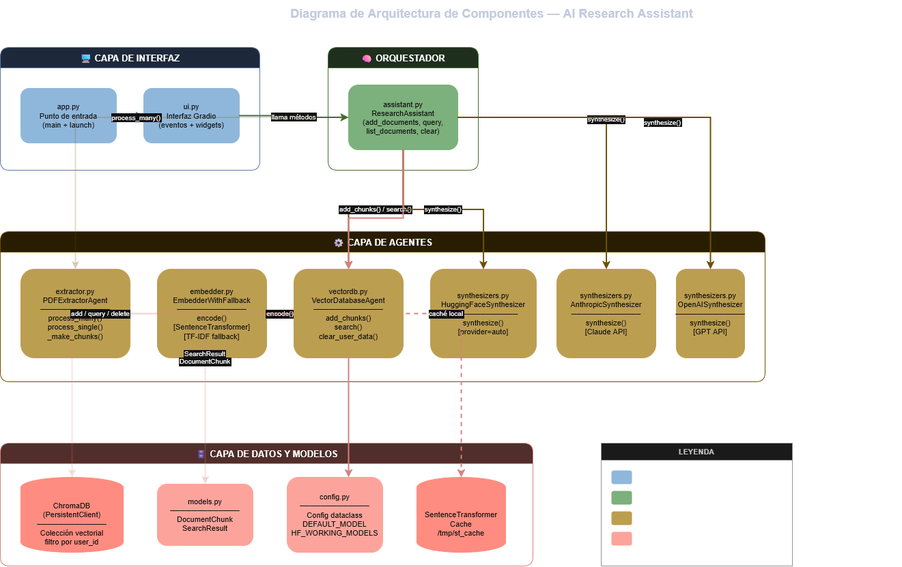
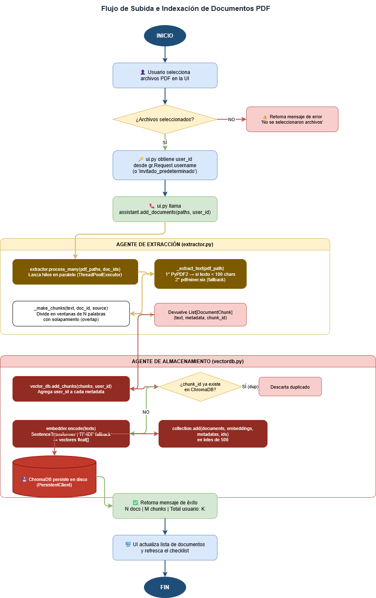
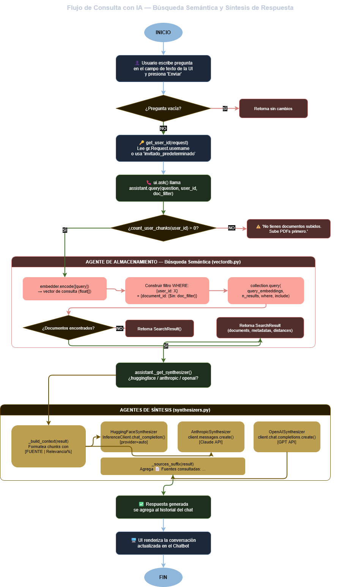
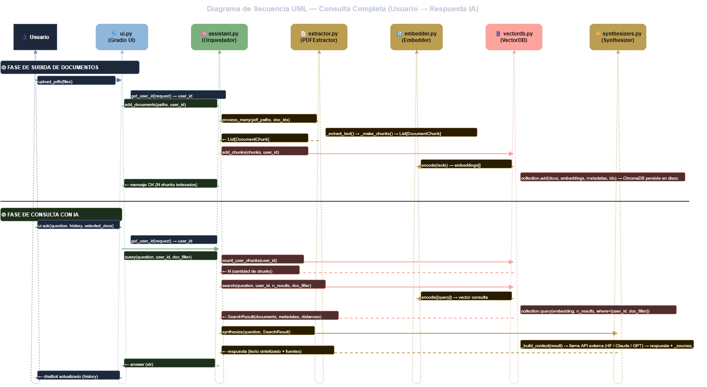
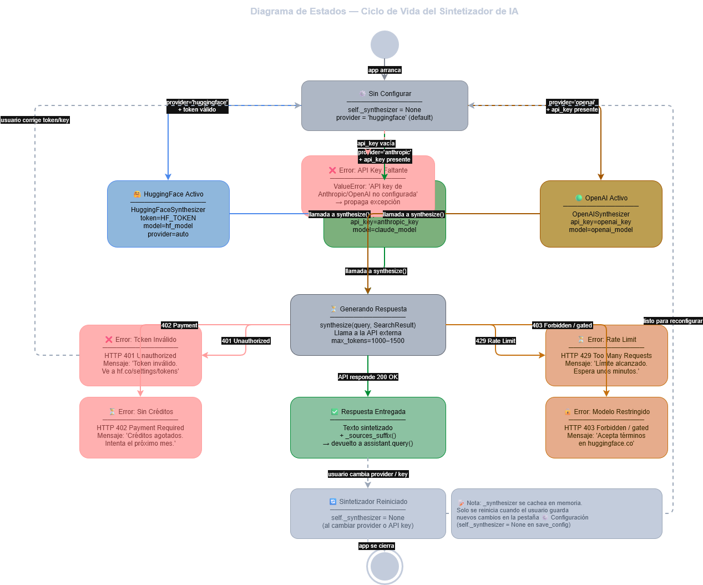
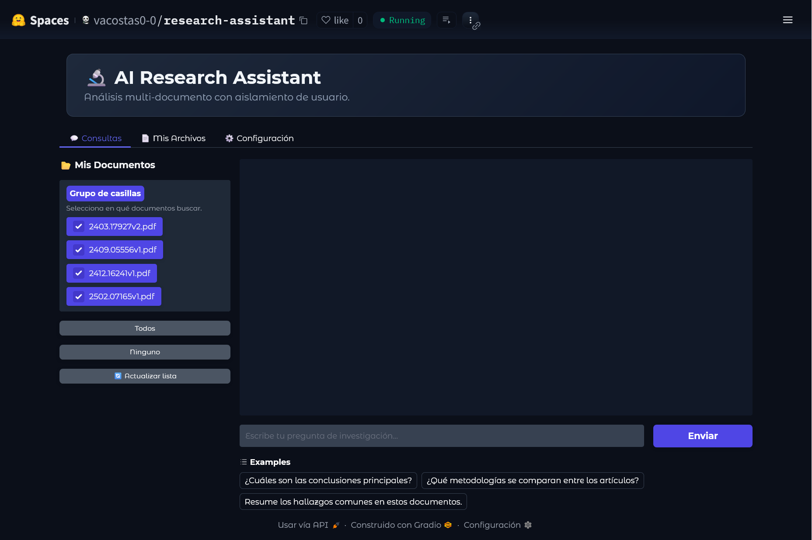
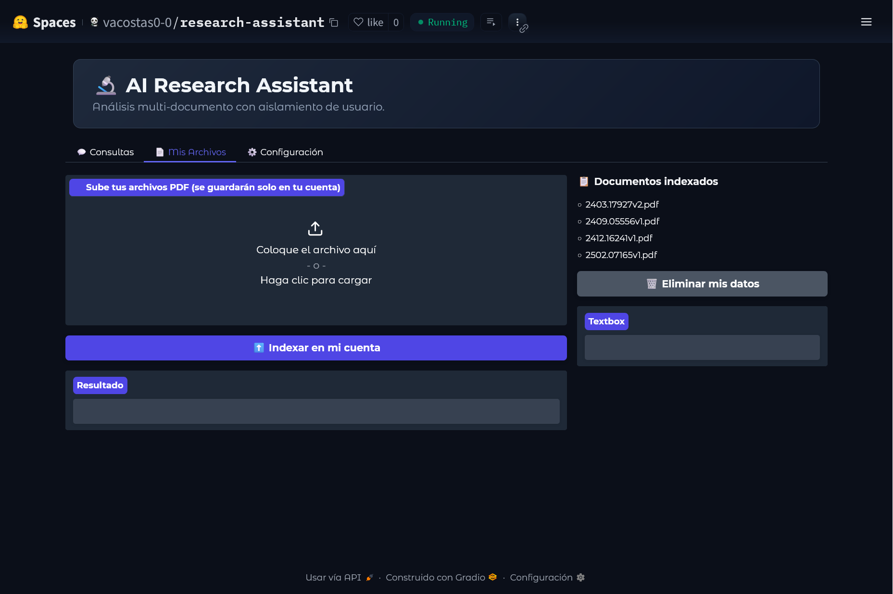
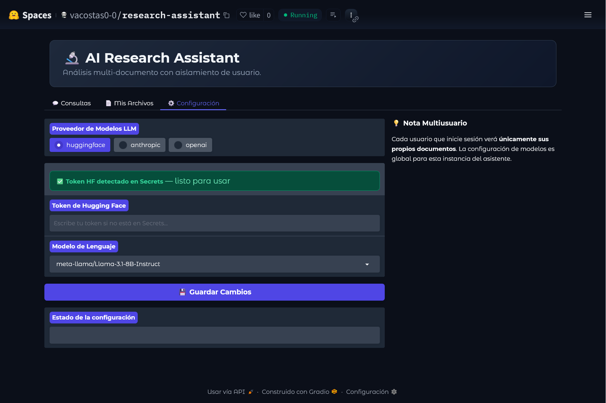

# 🔬 AI Research Assistant v3.2

> **Trabajo de Titulación — Universidad Técnica del Norte**  
> Carrera de Tecnologías de la Información  
> Autora: Victoria Acosta Sarauz · Director: Pablo Andrés Landeta López · 2025

Sistema multiagente para la extracción, almacenamiento y síntesis de información relevante en artículos académicos, desarrollado con **arquitectura RAG** (Retrieval-Augmented Generation) y orquestación de agentes mediante **CrewAI**.

🚀 **Demo en vivo:** [https://huggingface.co/spaces/vacosta0-0/advanced-ai-research-assistant](https://huggingface.co/spaces/vacosta0-0/advanced-ai-research-assistant)

---

## 📋 Descripción del Proyecto

Este sistema permite a investigadores cargar artículos académicos en formato PDF, indexarlos semánticamente y realizar consultas en lenguaje natural. El sistema responde citando las fuentes correspondientes dentro de los documentos analizados.

### Problema que resuelve

Los investigadores dedican hasta el 30% de su tiempo laboral a filtrar y procesar literatura académica. Este sistema automatiza ese proceso mediante:

- Extracción inteligente de texto desde PDFs con doble estrategia (PyPDF2 + PDFMiner)
- Indexación semántica vectorial con ChromaDB y embeddings `all-MiniLM-L6-v2`
- Búsqueda por significado semántico, no solo por palabras clave
- Síntesis académica de respuestas con citas a los fragmentos originales
- Aislamiento completo de datos por usuario (multiusuario)

---

## 🏗️ Arquitectura del Sistema

El sistema implementa una **arquitectura multiagente secuencial** basada en CrewAI con cuatro agentes especializados:

```
┌─────────────────────────────────────────────────────────────────────┐
│                    Gradio UI — 3 pestañas                           │
│        💬 Consultas │ 📄 Mis Archivos │ ⚙️ Configuración           │
└──────────────────────────────┬──────────────────────────────────────┘
                               │
┌──────────────────────────────▼──────────────────────────────────────┐
│                  ResearchAssistant (Orquestador)                     │
│                        assistant.py                                  │
├──────────────────┬──────────────────────┬───────────────────────────┤
│ PDFExtractorAgent│  VectorDatabaseAgent │   CrewAI (4 agentes)      │
│  extractor.py    │     vectordb.py      │   crew_agents.py          │
│                  │                      │                           │
│ · PyPDF2         │ · ChromaDB           │ 1. Planificador           │
│ · PDFMiner       │ · all-MiniLM-L6-v2  │ 2. Recuperador            │
│ · Chunking       │ · Aislamiento user   │ 3. Evaluador              │
│   size=600       │ · Similitud coseno   │ 4. Sintetizador           │
│   overlap=100    │                      │                           │
└──────────────────┴──────────────────────┴───────────────────────────┘
                                          │
                               ┌──────────▼──────────┐
                               │   Groq API (gratis) │
                               │  llama-3.3-70b-     │
                               │  versatile          │
                               └─────────────────────┘
```

### Los 4 agentes CrewAI

| Agente | Rol | Responsabilidad |
|---|---|---|
| **Planificador** | `Planificador de búsqueda académica` | Reformula la pregunta del usuario en una query corta y optimizada para búsqueda semántica |
| **Recuperador** | `Recuperador de información` | Ejecuta la búsqueda vectorial en ChromaDB usando la query optimizada |
| **Evaluador** | `Evaluador de contexto` | Determina si el contexto recuperado es SUFICIENTE o INSUFICIENTE |
| **Sintetizador** | `Sintetizador académico` | Redacta la respuesta final (máx. 3 párrafos) citando las fuentes por documento |

El proceso sigue un flujo **secuencial**: Planificar → Recuperar → Evaluar → Sintetizar.

---

## 🗂️ Estructura del Repositorio

```
v3-huggingface/
│
├── app.py                # Punto de entrada: verifica dependencias y lanza Gradio
├── assistant.py          # Orquestador principal — coordina extractor, vectordb y CrewAI
├── config.py             # Configuración centralizada (modelos, chunk_size, overlap, rutas)
├── crew_agents.py        # Definición de los 4 agentes CrewAI con Groq como LLM
├── extractor.py          # Agente de extracción: PyPDF2 + PDFMiner, chunking con overlap
├── embedder.py           # Generación de embeddings semánticos (SentenceTransformer + TF-IDF fallback)
├── vectordb.py           # Agente de almacenamiento: ChromaDB con aislamiento por usuario
├── synthesizers.py       # Sintetizadores: HuggingFace, OpenAI (no usados en modo CrewAI)
├── ui.py                 # Interfaz Gradio con 3 pestañas y soporte multiusuario
├── models.py             # Estructuras de datos: DocumentChunk, SearchResult
├── requirements.txt      # Dependencias del proyecto
│
├── diagrams/             # Diagramas de arquitectura del sistema
│   ├── D1.png            # Arquitectura de componentes
│   ├── D2.png            # Flujo de indexación
│   ├── D3.png            # Flujo de consulta RAG
│   ├── D4.png            # Diagrama de secuencia UML
│   └── D5.png            # Ciclo de vida del sintetizador
│
└── screenshots/          # Evidencias de funcionamiento en HF Spaces
    ├── EV1.png           # Interfaz de consultas
    ├── EV2.png           # Gestión de archivos
    └── EV3.png           # Configuración dinámica
```

---

## 🏗️ Diagramas de Arquitectura

### Arquitectura de Componentes


### Flujo de Indexación


### Flujo de Consulta (RAG)


### Diagrama de Secuencia UML


### Ciclo de Vida del Sintetizador


---

## 📸 Evidencias de Funcionamiento

### 💬 Interfaz de Consultas

*Chatbot interactivo con soporte multi-documento. El usuario selecciona sobre qué PDFs consultar y el sistema responde citando las fuentes.*

### 📄 Gestión de Archivos

*Panel para subir, indexar y eliminar PDFs. Los datos de cada usuario están aislados.*

### ⚙️ Configuración Dinámica

*Selector de proveedor LLM. El modo recomendado es Groq (gratuito) con `llama-3.3-70b-versatile`.*

---

## ⚙️ Instalación y Despliegue Local

### Requisitos previos

- Python 3.10 o superior
- Cuenta en [Groq](https://console.groq.com) para obtener API key gratuita

### 1. Clonar esta rama

```bash
git clone -b v3-huggingface https://github.com/vacosta0-0/advanced-ai-research-assistant.git
cd advanced-ai-research-assistant
```

### 2. Crear entorno virtual

```bash
python -m venv venv

# Linux / Mac:
source venv/bin/activate

# Windows:
venv\Scripts\activate
```

### 3. Instalar dependencias

```bash
pip install -r requirements.txt
```

### 4. Configurar variables de entorno

```bash
# Obligatoria para el modo CrewAI + Groq (gratuito):
export GROQ_API_KEY="tu_key_aqui"

# Opcional — para modo Hugging Face:
export HF_TOKEN="tu_token_hf"
```

### 5. Ejecutar

```bash
python app.py
```

La interfaz se abre en `http://localhost:7860`

---

## 🚀 Despliegue en Hugging Face Spaces

1. Crea un nuevo Space en [huggingface.co/spaces](https://huggingface.co/spaces) con SDK **Gradio**
2. Sube todos los archivos `.py` y `requirements.txt` de esta rama
3. En **Settings → Repository secrets**, agrega:
   - `GROQ_API_KEY` → tu API key de Groq (gratuita)
   - `HF_TOKEN` → tu token de Hugging Face (opcional)
4. El Space se construye automáticamente

> ⚠️ **Nota sobre el tier gratuito de Groq:** El plan gratuito de Groq aplica límites de tokens por minuto (TPM). El sistema está configurado con `max_tokens=600` y `n_results=3` para operar dentro de esos límites. En evaluaciones con muchas consultas consecutivas, se recomienda agregar pausas entre solicitudes.

---

## 📦 Dependencias

| Librería | Versión | Uso |
|---|---|---|
| `gradio` | ≥4.0.0 | Interfaz web multiusuario |
| `crewai` | ≥0.28.0 | Orquestación de agentes |
| `crewai-tools` | ≥0.1.0 | Herramientas personalizadas para agentes |
| `litellm` | ≥1.35.0 | Capa de abstracción LLM para CrewAI |
| `groq` | ≥0.9.0 | Cliente Groq API |
| `chromadb` | ≥0.4.0 | Base de datos vectorial persistente |
| `sentence-transformers` | ≥2.2.2 | Embeddings semánticos (`all-MiniLM-L6-v2`) |
| `PyPDF2` | ≥3.0.0 | Extracción de texto de PDFs |
| `pdfminer.six` | ≥20221105 | Extracción robusta de PDFs complejos |
| `huggingface_hub` | ≥0.20.0 | Inference API de Hugging Face |
| `numpy` | ≥1.24.0 | Operaciones numéricas |
| `anthropic` | ≥0.20.0 | Cliente Anthropic (proveedor opcional) |
| `openai` | ≥1.10.0 | Cliente OpenAI (proveedor opcional) |

---

## 🔬 Descripción Técnica Detallada

### Extracción de Texto — `extractor.py`

El `PDFExtractorAgent` implementa doble estrategia de extracción:
- **PyPDF2** como primera opción (rápida)
- **PDFMiner** como respaldo para PDFs con estructura compleja
- **Chunking con overlap**: fragmentos de `chunk_size=600` caracteres con `overlap=100` para preservar contexto entre fragmentos

### Base de Datos Vectorial — `vectordb.py`

El `VectorDatabaseAgent` gestiona ChromaDB con:
- Embeddings generados por `all-MiniLM-L6-v2` (384 dimensiones)
- Distancia coseno explícita (`hnsw:space: cosine`)
- **Aislamiento por usuario**: cada usuario tiene su propia colección lógica dentro de ChromaDB, sin acceso a documentos de otros usuarios
- El ID de usuario en HF Spaces es `"invitado_predeterminado"` cuando no hay login OAuth

### Agentes CrewAI — `crew_agents.py`

Los 4 agentes utilizan **Groq** como proveedor LLM (modelo `llama-3.3-70b-versatile`, gratuito) mediante LiteLLM. El **Recuperador** dispone de una herramienta personalizada `BuscarEnDocumentosTool` que conecta directamente con el `VectorDatabaseAgent`. El sistema sigue el proceso `Process.sequential` de CrewAI.

### Configuración — `config.py`

Toda la configuración está centralizada en la dataclass `Config`:

```python
chunk_size: int = 600       # Tamaño de fragmentos de texto
overlap: int = 100          # Solapamiento entre fragmentos
n_results: int = 5          # Resultados de búsqueda vectorial
embedding_model: str = "all-MiniLM-L6-v2"
collection_name: str = "research_papers_v32"
persist_directory: str = "/tmp/chroma_db_v32"
```

---

## 📊 Evaluación del Sistema (OE3)

El sistema fue evaluado mediante un dataset de 12 preguntas basadas en cuatro artículos científicos proporcionados por el tutor:

| Paper | Identificador |
|---|---|
| MAGIS: LLM-Based Multi-Agent Framework for GitHub Issue Resolution | `2403.17927` |
| Agents Are Not Enough | `2412.16241` |
| Principle-Based Prompting | `2502.07165` |
| SciAgents: Automating Scientific Discovery | `2409.05556` |

Las métricas calculadas son **Precision**, **Recall**, **F1-Score** y **ROUGE-L** sobre las respuestas generadas vs. respuestas de referencia. La evaluación se ejecuta desde la pestaña "📊 Evaluación OE3" del sistema desplegado.

> **Nota metodológica:** El plan gratuito de Groq API aplica límites de tokens por minuto, lo que puede provocar degradación a síntesis TF-IDF en algunos casos. Este comportamiento está documentado como limitación del entorno de despliegue y se describe en el Capítulo 4 de la tesis.

---

## 🔗 Relación con otras ramas

| Rama | Descripción |
|---|---|
| `main` | Prototipo inicial — script de consola con menú interactivo |
| `v2-multiproveedor` | Versión intermedia — UI web con soporte multi-proveedor exploratorio |
| `v3-huggingface` ← **esta rama** | Versión final — arquitectura modular completa con CrewAI, desplegada en HF Spaces |

---

## 👤 Autor

**Victoria Acosta Sarauz**

- Universidad: Universidad Técnica del Norte
- Facultad: Ingeniería en Ciencias Aplicadas
- Carrera: Tecnologías de la Información
- Director de tesis: Pablo Andrés Landeta López
- Año: 2025

---

## 📄 Licencia

Este proyecto se desarrolla con fines académicos como parte de un Trabajo de Integración Curricular para la obtención del título de Ingeniería en Tecnologías de la Información en la Universidad Técnica del Norte.

Distribuido bajo la licencia **MIT**. Consulta el archivo [LICENSE](LICENSE) para más detalles.

---

## 🙏 Reconocimientos

- [CrewAI](https://github.com/crewAIInc/crewAI) — framework de orquestación de agentes
- [Groq](https://groq.com) — inferencia LLM gratuita y de alta velocidad
- [ChromaDB](https://www.trychroma.com/) — base de datos vectorial de código abierto
- [Sentence Transformers](https://www.sbert.net/) — embeddings semánticos
- [Gradio](https://gradio.app/) — interfaz web para modelos de IA
- [Hugging Face](https://huggingface.co/) — plataforma de despliegue y modelos
